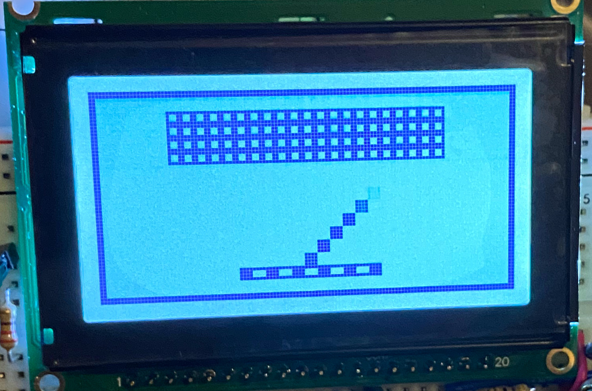
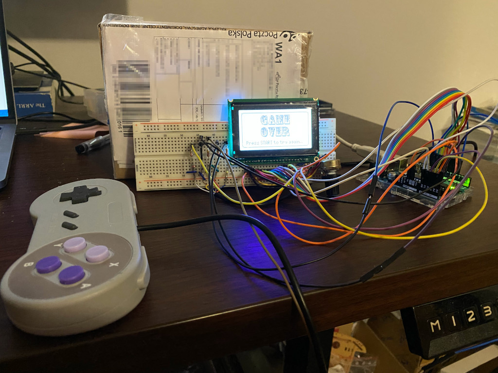

# Simple Arduino game

Parts:
* Arduino Uno
* SNES Controller (bought on Aliexpress)
* 128x64 graphic LCD (bought on [TME](https://www.tme.eu/en/details/rg12864b1/lcd-graphic-displays/raystar-optronics/rg12864b-ghw-v/)) - _RG12864B-GHW-V RAYSTAR OPTRONICS_

In `docs` folder you will find:
* LCD Datasheet, LCD Controller Datasheet
* SNES Controller interface description (thanks to Propeller/Hydra project)
